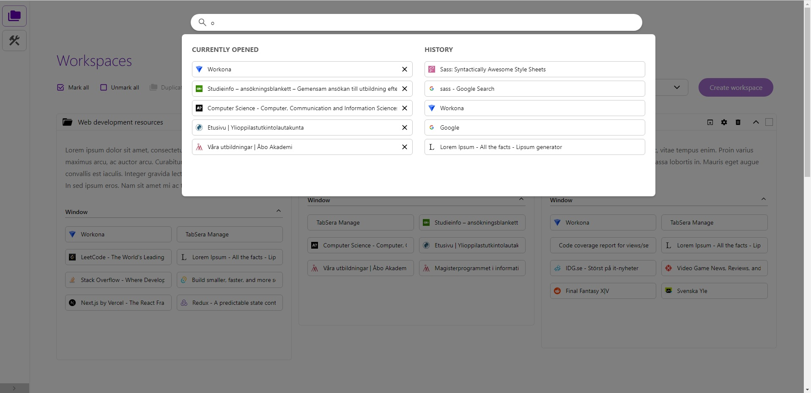
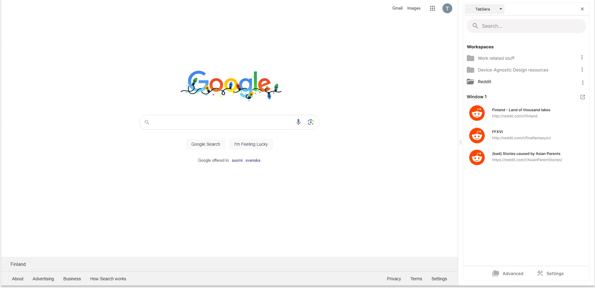

# TabSera - Extensive tab management

TabSera gives you a better oversight and improved tab management experience not provided
by default browser features.

## Installation

- Firefox: No releases as of now
- Chrome: No releases as of now
- Microsoft Edge: No releases as of now

## Development

Before you begin, make sure Node Package Manager (npm) is installed on your computer. The build and testing
commands depend on this.

1. Clone this repository to a folder on your computer
2. Open Google Chrome (preferably. Optimization for Firefox and Edge will be done at a later time)
3. Go to Chrome's menu -> Extensions -> Manage Extension
4. Turn on Developer mode
5. Click "Load unpacked"
6. Head for ***/tabfolders/dist/*** and select it
7. Voila, the extension is now installed!

- __Open options page:__ Click "Details" in the extension's box. Scroll down and click "Extension options"

### Commands

Go to /tabfolders.

__Build__

```
npm run build
```

The build will be available in the ./dist folder. This folder can be loaded
as a unpacked webextension into the browser. This folder is also used when packaging the extension
for distribution.

__Test__

```
npm run coverage
```

Run unit and integration tests (JEST) and generate coverage results. The tests are available in /src/__tests__.
The coverage is presented in ./coverage/Icov-report/index.html

Run this command after changing existing components, to check if anything gets broken. Add new tests when adding new components or features.

### Programming and tools

- HTML5 
- CSS3/SASS, 
- Javascript/Typescript, 
- React
- Redux
- JEST
- Tailwind
- Webextension API

## Features

### Options page

Extended oversight and management features can be found in the options page (right click the extension icon to the top right of your browser). This includes creating, merging, sorting and duplicating workspaces.




### Upcoming Feature: Extension sidebar

Tabsera will in the future provide immediate access to existing workspaces. The idea
is to quickly give the user a simple oversight over saved windows and tabs by
nesting.

Simple, non-extended, versions of features available in the option page will also be available in the sidebar.



# Feedback
I would appreciate feedback and suggestions on how to improve this plugin. Reports of possible bugs are also welcome. Please, post an issue or contact me per email: privat_thai_nguyen@hotmail.com

# Updates
Minor updates and improvements will be provided from time to time. There is no definite roadmap or schedule.

# Copyright &copy;
TabSera was created by Thai Nguyen. This plugin is free for private and professional use, with no limits nor warranty. The plugin itself and its code may not be monetized, re-distributed, nor used as part of commercial products/services/brands.

# Contact information
Email: privat_thai_nguyen@hotmail.com
