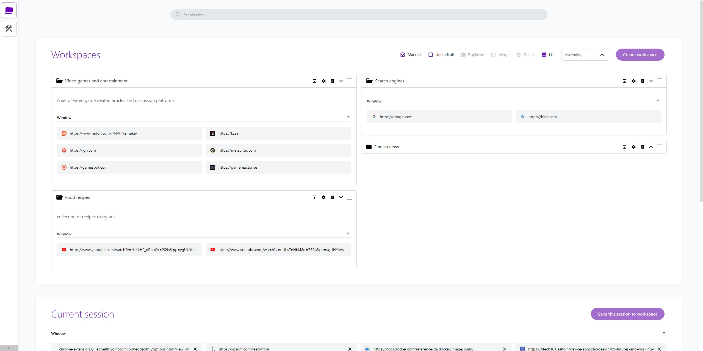
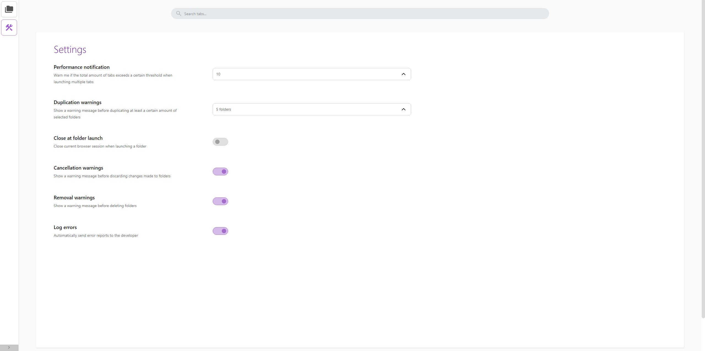
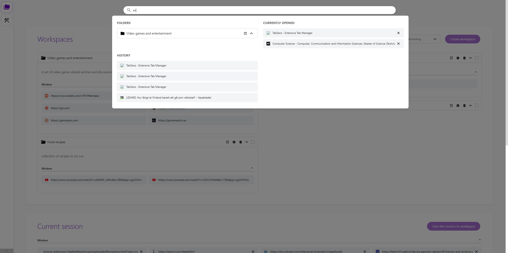
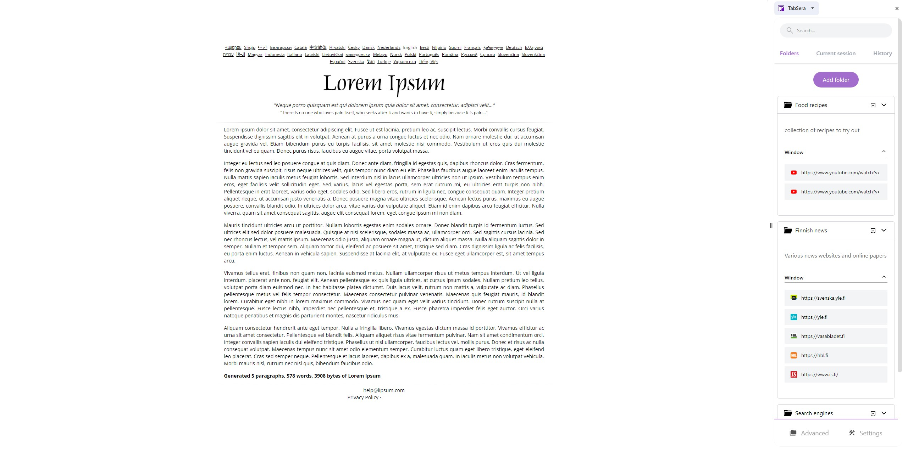

# Tab Management Browser Plugin (Beta)

<div style="text-align: center; margin: 2rem auto">
    
</div>

This plugin gives you a better overview and improved tab management experience not provided
by default browser features.  Mark, arrange, and open tabs in any way you like, e.g. new session, categorized session, or incognito.

## Issue and purpose

Add your windows and tabs to accessible folders. Launch sets of entertainment, or open your work related
resources with just one click.

Simple overview and basic features can be opened with one click. More advanced featuress and extended overview is also available through the option menu.

## Screenshots

   

## Features

- Create and edit workspaces
- Duplicate and merge workspaces
- Launch workspace in either incognito or as groups
- Tab search and filtering (filtering not implemented yet)
- Tab suspension (upcoming)
- Tab tagging/filtering (upcoming)
- Nesting windows/tabs/workspaces (for now, only windows and tabs are nested within workspaces)
- Simplistic sidepanel, for quick overview
- Options page for extended overview

## Programming and tools

HTML5, CSS3/SASS, Javascript/Typescript, React, Redux, JEST, Tailwind, Webextension API

## Installation

- Firefox: No releases as of now
- Chrome: No releases as of now
- Microsoft Edge: No releases as of now

## Development

Before you begin, make sure Node Package Manager (npm) is installed on your computer. The build and testing
commands depend on this.

### Commands

__Build__

```
npm run build
```

The build will be available in the ./dist folder. This folder can be loaded
as a unpacked webextension into the browser. This folder is also used when packaging the extension
for distribution.

NOTE: There is no bundling as of now. That will be added later.

__Test__

```
npm run test-coverage
```

Run unit and integration tests (JEST). The tests are available in /src/__tests__. The coverage is presented in ./coverage/Icov-report/index.html

Run this command after changing existing components, to check if anything related to user interaction gets broken. Add new tests when adding new components or features. The tests are written to test user's interaction with the components.

### Install unpacked dev version in Chrome or Edge

1. Clone this repository to a folder on your computer
2. Open Google Chrome (preferably. Optimization for Firefox and Edge will be done at a later time)
3. Build the project
3. Go to Chrome's menu -> Extensions -> Manage Extension
4. Turn on Developer mode and click "Load unpacked"
5. Head for ***/tabfolders/dist/*** and select it

- __Open options page:__ Click "Details" in the extension's box. Scroll down and click "Extension options"
- __Open the sidepanel:__ Click the  icon in your browser's toolbar

# Updates
Minor updates and improvements will be provided from time to time. There is no definite roadmap or schedule.


# Feedback
I would appreciate feedback and suggestions on how to improve this plugin. Reports of possible bugs are also welcome. Please, post an issue or contact me per email: privat_thai_nguyen@hotmail.com

# Contact information
Email: privat_thai_nguyen@hotmail.com

# Copyright &copy; Thai Nguyen
This plugin is free for private and professional use, with no limitations nor warranty. The plugin itself and code deriving from it may not be monetized, re-distributed, nor used as part of commercial products/services/brands.